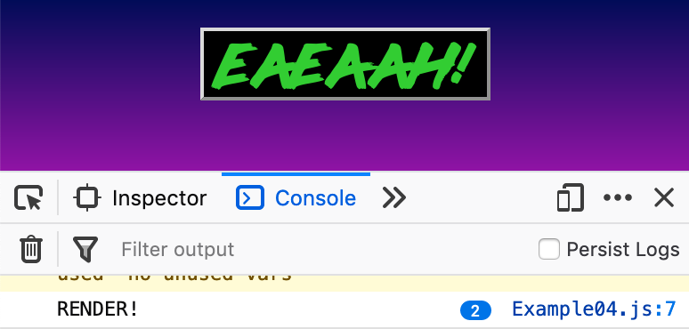
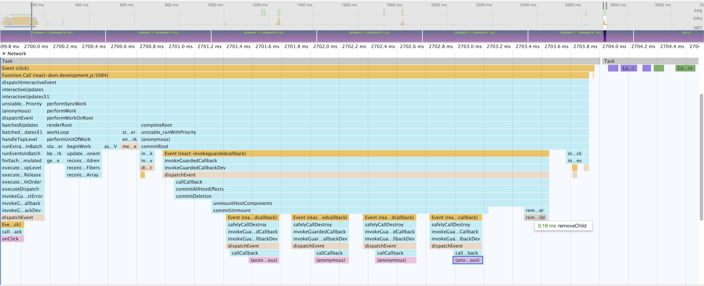

# Meet Hooks
*Hanging Up the Carcass of Class-Based React Components*

> February 6, 2019: React 16.8 is officially released and, with it, the promise of a cleaner and simpler tomorrow for React developers. React Hooks virtually eliminate the need for class-based components and allow for reusable state logic while still maintaining full backward compatibility. This talk will include an introduction to the new Hooks API, show how hooks are used and how they work, dive into some technical details with some common use cases as examples, and explore what's been established so far in terms of best practices.

> **Target Audience:** React developers interested in using react hooks, refining their understanding of the way hooks work, anyone interested in diving into React, or super hardcore React nerds interested in nitpicking a talk about react hooks.

> ⚠️This assumes a basic understanding of JavaScript/HTML fundamentals. Working knowledge of React is helpful but not required.

# Intro

# History/Rationale
## History
- On October 25th, 2018, The React team posted [an RFC](https://github.com/reactjs/rfcs/pull/68) called 'RFC: React Hooks #68' which proposed a system for using state, and other features previously exclusive to 'class' components, in functional components. The next day, it was announced at React Conf. After months of enthusiastic feedback from developers, exactly 3 months ago (prior to when this talk was given), Hooks became an official part of React on Feb 6, 2019 in react [16.8.0](https://github.com/facebook/react/releases/tag/v16.8.0).

## Why?
- It's annoying/difficult/occasionally impossible to re-use stateful logic between components.
  - Complex components can be ludicrously difficult understand just by reading the code.
    - Component lifecycle methods usually contain messes of unrelated code with actually related code in other lifecycle methods and it's hard to break them apart.
      - ⁉️This implies that unrelated effects with the same dependencies should be broken into separate hooks. Does that have any implications to performace?
  - Classes are confusing and weird in JavaScript (for people and [machines?])
    - They work differently than in other languages, creating an additional barrier to entry.
    - ⁉️Why are they confusing for machines? Maybe check Dan's talk
      -  They're hard to minify. Instance methods will frequently be unminified and unused methods often end up in compiled code.
      - This was in Sophie Alpert's portion of the talk.
  - Reliance on HOCs can lead to "wrapper hell" which makes your component hierarchy tedious and unwieldy.

## Benefits
- Full backward compatibility
  - While Hooks are recommended for future develpoment in React, there are no plans to discontinue support for class-based components.
  - Once your probject is on React >=16.8.0, you can begin writing new components using Hooks and they'll get along just fine with your existing class-based components.
    - *Note: Hooks cannot be used in class based components so a rewrite of a single component can't be done gradually*
  
# Meet Hooks

Let's lay down some groundwork to make sure everyone's on the same page, and then go over some of the most useful hooks in detail.

## Basics of Functional Components
Since this talk is meant to be accessible to React beginners, I'd like to spend a few minutes talking about how functional components work in React. I won't be talking about class components because *where we're going, we don't need classes.*
I'll also only be using arrow functions because I need to get my money's worth on deez ligatures.

#### Parts of a functional component
```jsx
const definedAsFunction = ({acceptsPropObject}) => <ReturnsJSX />
```
A functional React component has three fundamental characteristics.
- It's defined as a function (that's why they call them *functional*)
- Accepts a `props` object as an argument
- Returns JSX which is a syntax extension to JavaScript but you can think of it conceptually as magic HTML that *lives* in JavaScript.

Furthermore, just like any function, a functional component can do stuff before it returns a value:
```jsx
const definedAsFunction = ({acceptsPropObject}) => {
  doStuff();
  return <ReturnsJSX />
}
```

Functions that return JSX can be used as JSX elements in other components.
```jsx
const AnotherComponent = () => <span>I'm super neat</span>
const definedAsFunction = ({acceptsPropObject}) => {
  doStuff();
  return <ReturnsJSX>
    <AnotherComponent someProp={acceptsPropObject} />
  </ReturnsJSX>
}
```

> ⚠️Important note for beginners: Javascript expressions can be used in JSX by enclosing them in `{ curly braces }`

When a component is rendered or re-rendered, its function is called along with the functions for all of its child components all the way down the tree. This can be optimized with `React.memo()` but that's not important right now. Any and all changes that the rerender causes will be reflected in React's Virtual DOM which React will then use to decide which changes should be flushed to the actual DOM to be painted by the browser. The juicy part of this is that the re-render on the virtual DOM is way less computationally expensive than a similar operation on the actual DOM.

> ❗️A diagram would be nice here.

### Some Hooks
The basic Hooks I want to go over in detail are `useState`, `useEffect`, and `useRef`. [React documentation](https://reactjs.org/docs/hooks-reference.html) lists `useContext` instead of `useRef` as one of the three basic hooks, but I've found `useRef` to be more useful.

#### useState( )

Easily the most important hook is the `useState` hook... which looks like this:

```jsx
const Highlander = () => {
  const [howManyThereCanBe, setHowManyThereCanBe] = useState(1);
  return <p>
    {`⚔️"THERE CAN BE ONLY ${howManyThereCanBe}!”️️⚡️`}
    <button 
      onClick={() => setHowManyThereCanBe(howManyThereCanBe + 1)}
    >
      Learn   To   Share!
    </button>
  </p>
}
```

> ⚠️ Let's note early that one constraint of hooks is that they can only be defined in the top level of their function.

This hook defines a stateful value and a function for setting that value, returned in a pair. Convention is to assign these via array destructuturing as seen so that the setter is called `set` + the name of the value. Array destructuring is a common pattern for using hooks.

On the initial render, the value of the stateful value is that of whatever is passed as an argument to `useState`. Calling the `set` function enqueues a rerender of the component replacing the stateful value with the new value. If it's the same value, the render will "bail out," meaning that it may re-render itself, but won't rerender deeper into the tree. 

Since calling the `set` function triggers a rerender, this means the stateful value provided by `useState` is constant for each render. The props and state of any render belong to that render and do not change. If one of those changes, you can be sure it's another render.

A lot like `setState` in class components, updates to `useState` values at around the same time will be grouped together so that they're applied to the same rerender. 

Also a lot like `setState`, the `set` function returned from `useState` can accept a function to update state based on previous state:
```jsx
const GraduallyScreamierButton = () => {
  const [buttonText, setButtonText] = useState('AH!')
  const getScreamier = () => setButtonText(prev => `A${prev}`)
  return <button onClick={getScreamier} />
}
```

As an example of how `useState`'s update grouping works, consider the following bit of code:

```jsx
const GraduallyScreamierButton = () => {
  const [buttonText, setButtonText] = useState('AH!')
  const getScreamier = () => {
    console.log('RENDER!')
    setButtonText(prev => `A${prev}`)
    setButtonText(prev => `E${prev}`)
  }
  return <button onClick={getScreamier}>{buttonText}</button>
}
```

We define a stateful value, `buttonText` with `useState` to keep track of a text string. We define a function that logs "RENDER!" to the console and then calls `setButtonText` twice in a row: The first time prepending an 'A' to `buttonText`, the second time prepending an 'E' to `buttonText`. The component returns a button element that calls our function on each click.

Since `setButtonText` enqueues a rerender each time it's called, and it's called twice in a row appending a different value to the beginning of the previous value, which of the following behaviors would you expect?

**A.** Button says **"AEAEAH!"** and logs "RENDER!" **twice per click**
**B.** Button says **"EAEAAH!"** and logs "RENDER!" **twice per click**
**C.** Button says **"EEEEAH!"** and logs "RENDER!" **twice per click**
**D.** Button says **"AAAAAH!"** and logs "RENDER!" **once per click**
**E.** Button says **"EAEAAH!"** and logs "RENDER!" **once per click**
**F.** Button says **"AEAEAH!"** and logs "RENDER!" **once per click**

> ❗️This would be a nice place for an audience survey if I can get that to work

If you guessed **C**, you are the furthest from the right answer... which is **E**. The resulting scream will start with E and render once per click. Here's proof and why:

> ❗️Could switch to executing pre-written example


After two clicks, our button/console looks like this:

This is because the first `setButtonText` enqueues the rerender, but the rerender isn't instantaneous and JavaScript continues execution on this instance of the component. So when the second `setButtonText` enqueues a rerender to prepend an 'E' to our scream, it does so after the 'A' is prepended but on the same subsequent render.

#### useEffect( )

`useEffect` doesn't return anything. Its purpose is to execute imperitive side-effects in functional components: stuff like data fetching, subscriptions, manual DOM mutation, logging, etc...

```jsx
const EffectUser = () => {
  useEffect(() => {
    console.log("I am a side-effect and I will befoul your beautiful functional code!")
  }, [])
  return <p>
    DON'T LOOK AT ME!! My purpose is unrelated to my return value.
    </p>
}
```

`useEffect` accepts two arguments: a function that does stuff, and an array of dependencies. If you don't give it a second argument, the effect fires on every render. If you do provide an array of variables as the second argument, the effect will only run if one of those dependencies has changed on some render. If you want it to only run on the initial render, pass an empty array.

The function called by `useEffect` can also return a cleanup function to be run before the effect runs again or when the component unmounts. 

```jsx
const AlienSpacecraft = () => {
  // 🛸
  useEffect(() => {
    const abductee = tractorBeam.abductFrom('🌎', 'Some loony')
    lights.brightness = 'blinding'
    probulator.probe(abductee)
    probulator.probe(abductee)
    bigAlienJim.smackAroundALittleBit(abductee)
    probulator.probe(abductee)
    return () => tractorBeam.returnTo('🌎', abductee)
  })
  // ...
}
```

In the above example, the alien spacecraft will imperitively abduct some loony from earth *after* every render and do science on them. Importantly, because of the returned callback, the alien spacecraft will return the previous loony before abducting another one. This behavior is very important to ensuring you never have two of the same subscriptions or that you undo mutations to the DOM before repeating them.

I casually mentioned just now that the effect occurs *after* each render. By that, I mean that React only runs an effect after its render's changes are successful, are flushed to the DOM, and those changes are painted. Importantly, it is guaranteed to fire before any subsequent renders.
There is another hook, `useLayoutEffect` that is identical to `useEffect` but fires synchronously after DOM changes and prevents the browser from painting until it's complete. This is useful for side-effects that affect the UI to avoid messy rerenders.

It's strongly advised that your array of dependencies contains every variable from your component that is used by your effect (stateful values, props, etc.). This does not include variables defined inside your effect.

#### useRef( )

`useRef` provides a way to maintain a mutable value that persists for the lifetime of the component independent of the render cycle.

> ❗️This isn't a really good example
```jsx
const Watchmen = () => {
  const doctorManhattan = useRef(`
    I prefer the stillness here.
    I am tired of Component.
    These renders.
    I am tired of being caught in the tangle of their lives.
  `)
  return <Osterman ref={doctoManhattan}>"Bean Juice. Human Bean Juice."</p>
}
```

Its most obvious use is to keep a reference to a DOM element, but it can be used to keep any value around, much in the same way that an instance variable would stick around. The value lives in the `current` property of the returned value.

## The order things happen in

1. Initial Render
    1. React calls the function 
    1. `useState` Stateful values initialized to values passed as arguments.
    1. Component function returns JSX to React along with a list of effects that need to be fired.
    1. React updates the Virtual DOM, then 🚽 flushes necessary changes to the DOM.
    1. Effects from `useLayoutEffect` are fired and complete.
    1. 🎨 Browser Paints changes to the DOM
    1. Effects from `useEffect` are fired.
1. Subsequent Render (a stateful value is set with its `set` function or a change to props)
    1. React compares effect dependencies and determines which effects need to the rerun.
    1. React calls the function with updated props and state.
    1. Component function returns JSX to React along with a list of effects that need to be fired.
    1. React updates the Virtual DOM, then 🚽 flushes necessary changes to the DOM.
    1. Cleanup functions from `useLayoutEffect` that need to be rerun are fired synchronously.
    1. Effects from `useLayoutEffect` that need to be rerun are fired synchronously.
    1. 🎨 Browser Paints changes to the DOM
    1. Cleanup functions from `useEffect` that need to be rerun are fired synchronously.
    1. Effects from `useEffect` that need to be rerun are fired synchronously.
1. Unmount, once it is decided that the child must die.
    1. React updates Virtual DOM
    1. All cleanup functions are called in the order that they're defined. 
        - (This is how it goes. I don't know if it's important that it does or if it's just an implementation coincidence)
    1. 🚽 Flushes necessary changes to the DOM.
    1. 🎨 Browser Paints changes to the DOM


> 🖼This graph shows the child component in Example06 unmounting after `onClick` event (leftmost pink). The four effect cleanup functions can be seen running in the middle followed by the respective node being removed from the DOM. The layout and paint operations are in purple and green on the rightmost side.

## Making Your Own Reusable Hooks

One of the coolest things about Hooks is their composability and reusability. You might frequently find yourself implementing patterns and combinations of hooks in various components. The good news is you don't have to keep rewriting those same patterns anymore! By enclosing related hooks into their own function and returning an array of any relevant values and functions, you've made yourself a hook! As you may have gathered by now, convention is that any hook's name begins with `use`. This is for readability and for enforcing linting rules related to hooks.

## Testing

## Best Practices

  - There's no urgent need to uplift existing code to use components, and, even if you *really* want to, you should spend some time writing new code with Hooks and make sure you and your team are comfortable with them before rewriting existing complicated components.
  - Even if two distinct effects with unrelated logic share the same dependency list, remember that one of the benefits of Hooks is their ability to organize stateful logic into cohesive modules.
    - For instance, if a component has multiple different effects that only need to fire when the component mounts and clean up when the component unmounts, don't just throw them all into one `useEffect` with an empty array as the second argument. Split those puppies up!

## Error Handling

# Sources

https://reactjs.org/docs/hooks-intro.html#motivation
https://overreacted.io/a-complete-guide-to-useeffect/
